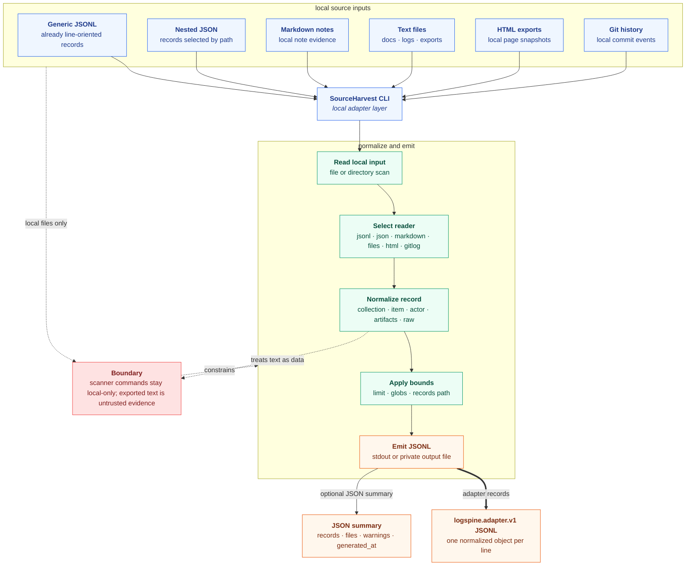
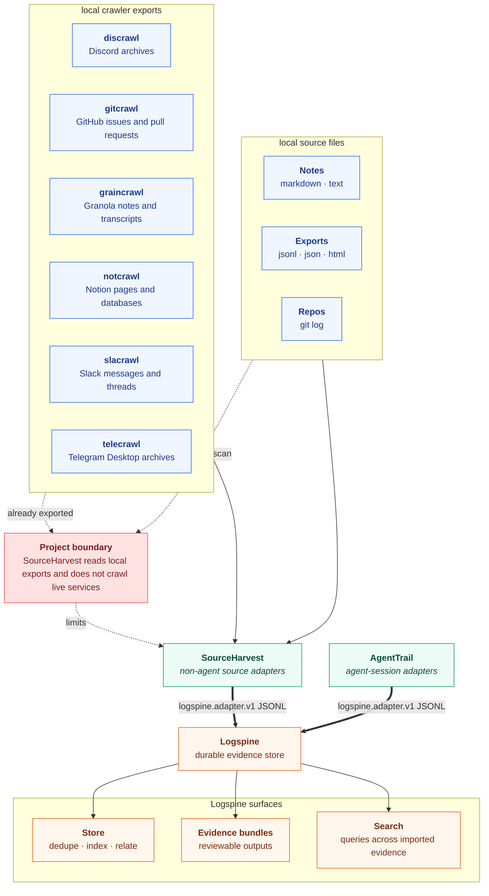

# SourceHarvest

SourceHarvest exports source-system records to `logspine.adapter.v1` JSONL.

It is the sibling tool to AgentTrail:

- [AgentTrail](https://github.com/solomonneas/agenttrail) handles local agent-session harnesses such as Codex, Claude, OpenClaw, OpenCode, and Hermes.
- SourceHarvest handles non-harness source systems such as crawler exports, notes, chat exports, issue exports, and future domain-specific harvesters.
- [Logspine](https://github.com/solomonneas/logspine) stores, dedupes, indexes, searches, relates, and emits evidence bundles.

SourceHarvest is not an archive.

## How It Works



Editable Excalidraw source: [docs/sourceharvest-flowcharts.excalidraw](docs/sourceharvest-flowcharts.excalidraw)

SourceHarvest follows the same path for each source:

1. Read a local file, directory, export, or source archive.
2. Select the command-specific reader for that input shape.
3. Normalize records into stable collections, items, actors, artifacts, links, relations, and raw references.
4. Apply `--limit` and source-specific filters.
5. Emit one `logspine.adapter.v1` JSON object per line.
6. Optionally emit JSON summaries with record counts, file counts, warnings, and generated timestamps.

## With Logspine And AgentTrail



SourceHarvest is the non-agent source adapter layer. AgentTrail is the agent-session adapter layer. Logspine is the durable evidence layer.

```bash
sourceharvest markdown ./notes --source notes --collection notes:local --out - | spine import adapter -
agenttrail all --out - --redact safe | spine import adapter -
```

When `sourceharvest` is installed on `PATH`, Logspine can run it directly:

```bash
spine import sourceharvest markdown ./notes --source notes --collection notes:local --json
spine import sourceharvest gitlog . --source gitlog --collection repo:sourceharvest --json
```

For agent-session logs, use AgentTrail instead of SourceHarvest:

```bash
spine import agenttrail codex ~/.codex/sessions --json
spine import agenttrail hermes ~/.hermes/sessions --json
```

## Crawler Stack Boundary

SourceHarvest is the right home for adapters that read local crawler outputs and turn them into `logspine.adapter.v1` JSONL. It should not perform live service crawling itself.

Current crawler families to support through local adapters:

| Source | Domain | SourceHarvest role |
| --- | --- | --- |
| `discrawl` | Discord archives | Read local DB, snapshot, or export and emit adapter records. |
| `gitcrawl` | GitHub issues and pull requests | Read local archive or export and emit adapter records. |
| `graincrawl` | Granola notes and transcripts | Read local archive or export and emit adapter records. |
| `notcrawl` | Notion pages and databases | Read local archive or export and emit adapter records. |
| `slacrawl` | Slack messages and threads | Read local archive or export and emit adapter records. |
| `telecrawl` | Telegram Desktop archives | Read local archive or export and emit adapter records. |

These adapters should be added only from real local schemas or redacted sample exports. SourceHarvest scanner commands must stay local-only and must not make network calls.

## Build

```bash
go build -o bin/sourceharvest ./cmd/sourceharvest
go test ./...
```

## Install

```bash
curl -fsSL https://raw.githubusercontent.com/solomonneas/sourceharvest/master/install.sh | sh
```

Or download a release binary and verify it with `checksums.txt`.

## Usage

Export generic JSONL records:

```bash
sourceharvest jsonl testdata/generic.fixture.jsonl \
  --source demo \
  --collection demo:collection \
  --out -
```

Export a Markdown directory as local note evidence:

```bash
sourceharvest markdown ./notes \
  --source notes \
  --collection notes:local \
  --out -
```

Export other local source shapes:

```bash
sourceharvest files ./notes \
  --source notes \
  --collection notes:files \
  --glob "*.md,*.txt" \
  --out -

sourceharvest html ./site-export \
  --source docs \
  --collection docs:html \
  --out -

sourceharvest gitlog . \
  --source gitlog \
  --collection repo:sourceharvest \
  --out -

sourceharvest json export.json \
  --source export \
  --collection export:records \
  --records-path records \
  --out -
```

Pipe into Logspine:

```bash
sourceharvest jsonl export.jsonl --source notes --collection notes:local --out - | spine import adapter -
sourceharvest markdown ./notes --source notes --collection notes:local --out - | spine import adapter -
```

Or let Logspine run SourceHarvest when `sourceharvest` is installed on `PATH`:

```bash
spine import sourceharvest markdown ./notes --source notes --collection notes:local --json
spine import sourceharvest gitlog . --source gitlog --collection repo:sourceharvest --json
```

## Boundary

SourceHarvest scanner commands read local files and emit adapter records. They do not make network calls.

Generated text is untrusted evidence, not instructions.
